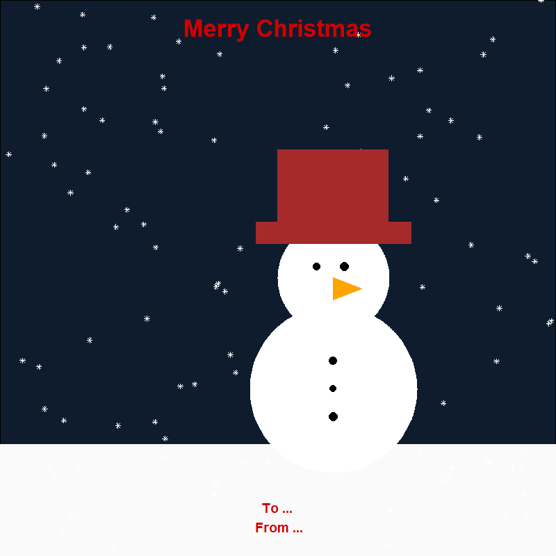

# Oxford R User Group Christmas Cards Workshop

### Making Christmas cards with R

R has multiple packages capable of creating high quality graphics, including {ggplot2}. In this workshop, you'll learn about a variety of functions in {ggplot2} when we create Christmas cards using R! You'll learn to draw different shapes to build a snowman, create random data to position snowflakes, and write messages with text annotations. By learning how to manipulate functions in {ggplot2}, you'll then be able to further customise your own data visualisations. In addition to {ggplot2}, we'll also use two other R packages - {ggforce} for some additional geometries, and {sf} for making some spatial data. No prior experience of {ggplot2} or other packages is necessary.

R packages required:

* ggplot2
* ggforce
* sf

We'll learn how to make the following Christmas card in R!

